# 2025학년도 국립한국해양대학교 대학원 종합 설문조사 결과 보고서

---

## 목차

1. [개요](#1-개요)
2. [문항개발 과정 및 근거](#2-문항개발-과정-및-근거)
3. [최종 문항 선정](#3-최종-문항-선정)
4. [설문 방법](#4-설문-방법)
5. [설문 시스템 설계](#5-설문-시스템-설계)
6. [설문 결과](#6-설문-결과)
7. [시사점 (안)](#7-시사점-안)
8. [부록](#8-부록)

---

## 1. 개요

### 1.1 설문 목적

본 설문조사는 국립한국해양대학교 대학원생의 **비교과 프로그램 만족도 및 수요**와 **교육/연구환경 만족도**를 체계적으로 파악하여, 대학원 교육의 질 향상 및 학생 지원 정책 수립을 위한 기초자료를 확보하는 것을 목적으로 한다.

구체적인 조사 목적은 다음과 같다.

- 대학원 비교과 프로그램에 대한 인지도, 참여 현황, 만족도 및 수요를 종합적으로 파악
- 대학원 교육서비스, 교육과정, 교육환경에 대한 재학생의 만족도를 측정
- 연구환경, 연구수행 경험, 산학협력, 진로지원 등에 대한 만족도를 조사
- BK21 4단계 사업 성과평가 지표에 부합하는 대학원생 만족도 자료 수집
- 대학기관평가인증 대학원 교육과정 및 연구환경 평가항목에 대응하는 근거자료 확보
- 대학원생의 중도포기 경험 및 사유를 파악하여 학생 복지 정책 개선에 기여

### 1.2 주관

국립한국해양대학교 대학원

### 1.3 설문 대상

국립한국해양대학교 재학 대학원생 전원 (일반대학원, 해사산업대학원, 해양과학기술전문대학원, 해양금융대학원, 글로벌물류대학원 포함, 5개 대학원)

### 1.4 설문 기간

2026년 2월 19일(목) ~ 2026년 2월 27일(금), 총 9일간

### 1.5 예상 소요 시간

15~20분

### 1.6 응답 현황 요약

| 항목 | 수치 |
|------|------|
| 전체 대학원생 수 (추정) | 약 1,350명 |
| 설문 응답자 수 | 610명 |
| 설문 완료자 수 | 562명 |
| 응답률 | 약 41.6% (완료 기준) |
| 한국어 응답 | 518명 (84.9%) |
| 영어 응답 | 92명 (15.1%) |

---

## 2. 문항개발 과정 및 근거

### 2.1 설문 구조 설계 원칙

본 설문은 **2파트 구조**(Part A, Part B)로 설계하였으며, 각 파트의 구성은 다음과 같다.

| 파트 | 주제 | 문항 수 | 비고 |
|------|------|---------|------|
| Part A | 비교과 프로그램 만족도 및 수요조사 | 16문항 | 프로그램 중심 평가 |
| Part B | 대학원 교육 및 연구환경 만족도 조사 | 50문항 | 교육/연구환경 중심 평가 |
| **합계** | | **66문항** | |

#### Part A/B 분리 이유

비교과 프로그램(Part A)과 교육/연구환경(Part B)은 평가 차원이 근본적으로 다르다. Part A는 대학원이 운영하는 **특정 프로그램에 대한 만족도와 수요**를 측정하며, Part B는 대학원 교육 전반의 **구조적 환경과 서비스 품질**을 측정한다. 두 차원을 분리함으로써 응답자가 각 영역에 집중하여 보다 정확한 평가를 제공할 수 있도록 하였다.

### 2.2 문항 유형 선정 근거

본 설문에서 활용한 문항 유형과 그 선정 근거는 다음과 같다.

| 문항 유형 | 활용 목적 | 선정 근거 |
|-----------|-----------|-----------|
| 5점 리커트 척도 | 만족도/동의도 측정 | 사회과학 설문의 표준 도구. 중립점(3점)을 포함하여 균형 잡힌 응답 유도 |
| 6점 척도 | 만족도 + 해당없음 | 프로그램 미경험자를 위해 6번째 선택지(해당없음/모름)를 추가하여 강제응답 회피 |
| 체크박스 | 복수응답 허용 | 인지도, 참여 프로그램, 어려운 점 등 여러 항목 동시 선택이 필요한 문항에 적용 |
| 라디오 | 단일선택 | 인구통계 정보, 동의 여부, 단일 선호 등 배타적 선택지를 가진 문항에 적용 |
| 순위형(ranking) | 우선순위 파악 | 진학동기, 지원제도 수요 등에서 1~3순위를 선택하도록 하여 상대적 중요도 파악 |
| 서술형(paragraph) | 개방형 질적 의견 수집 | 각 섹션 말미에 배치하여 정량적 문항으로 포착하지 못하는 구체적 의견 확보 |
| 단답형(text) | 구체적 정보 입력 | 학과명, 조건부 기타의견 등 짧은 자유 입력이 필요한 경우 적용 |

### 2.3 파트별 문항 구성 근거

#### Part A - 비교과 프로그램 만족도 및 수요조사 (총 16문항)

| 섹션 | 문항 수 | 구성 근거 |
|------|---------|-----------|
| A-1 프로그램 인지 | 2문항 | 프로그램 인지도와 실제 참여 현황을 분리 측정하여 인지-참여 격차(gap) 분석 가능 |
| A-2 만족도 평가 | 5문항 | 프로그램 유형별 만족도(3문항, 6점 척도) + 홍보/신청 절차 적절성(1문항) + 전반적 만족도(1문항) |
| A-3 효과성 평가 | 2문항 | 프로그램의 실질적 기여도를 연구역량 향상과 대학원 적응이라는 두 축으로 평가 |
| A-4 수요조사 | 5문항 | 어려운 점, 강화 필요 영역, 신규 희망 프로그램, 운영방식 선호, 시간대 선호를 종합 조사 |
| A-5 종합의견 | 2문항 | 미참여 사유(정량)와 자유 개선의견(정성)을 병행 수집하여 종합적 진단 |

#### Part B - 대학원 교육 및 연구환경 만족도 조사 (총 50문항)

| 섹션 | 문항 수 | 구성 근거 |
|------|---------|-----------|
| B-1 기본정보 | 8문항 | 소속, 학과, 과정, 학기, 성별, 학위진행형태, BK21 소속 여부 및 사업단명 -- 교차분석 변인 확보 |
| B-2 진학동기 및 진로 | 4문항 | 진학동기 순위(ranking) + 기타의견(조건부) + 희망진로(radio) + 기타(조건부) |
| B-3 교육서비스 | 22문항 | 교육서비스(9) + 교육과정/학사관리(8) + 교육환경(8) + 자유의견(3) -- 3개 하위 영역으로 세분화 |
| B-4 연구환경 | 21문항 | 연구환경(10) + 연구수행/진로탐색(5) + 연구몰입도 지원제도(2, ranking+조건부) + 신진연구인력 지원제도(2, ranking+조건부) + 산학협력(6) + 자유의견(2) |
| B-5 진로지원 및 생활환경 | 9문항 | 진로지원 만족도(6) + 중도포기 경험(1) + 중도포기 사유(조건부, 1) + 기타(조건부) + 개선의견(1) + 전반적 만족도(1) |
| B-6 종합의견 | 1문항 | 대학원 발전을 위한 종합 건의사항 (개방형) |

### 2.4 문항 설계 참고 기준

본 설문의 문항 설계 시 다음 기준을 참고하였다.

1. **BK21 4단계 사업 성과평가 지표**: 대학원생 만족도 조사 항목(교육환경, 연구환경, 진로지원 등)을 반영하여 BK21 사업 성과보고에 직접 활용 가능한 자료를 확보
2. **대학기관평가인증 대학원 평가항목**: 대학원 교육과정의 체계성, 연구환경의 적절성, 학생지원 체계 등 인증 평가 요소를 문항에 반영
3. **국내 주요 대학 대학원생 만족도 조사 선행연구**: 타 대학의 유사 조사 구조 및 문항 설계를 참고하여 비교 가능성 확보
4. **조건부 문항(conditionalOn) 도입**: 선행 응답에 따라 후속 질문을 동적으로 표시/숨김 처리하여 응답자 부담 경감 및 데이터 품질 향상
   - 예: '기타' 선택 시 기타의견 입력란 표시
   - 예: 중도포기 경험 '그렇다' 선택 시 사유 질문 표시

---

## 3. 최종 문항 선정

### 3.1 Part A - 비교과 프로그램 만족도 및 수요조사 (16문항)

| 문항번호 | 섹션 | 유형 | 문항 내용 | 필수 |
|----------|------|------|----------|------|
| A-1-1 | A-1 프로그램 인지 | checkbox | 다음 중 알고 있는 프로그램 유형을 모두 선택해 주세요. | 필수 |
| A-1-2 | A-1 프로그램 인지 | checkbox | 다음 중 실제 참여한 프로그램을 모두 선택해 주세요. | 필수 |
| A-2-1 | A-2 만족도 평가 | scale (1-6) | 연구역량강화 프로그램 (논문작성지원, 데이터분석교육, 학술대회 등) 만족도 | 필수 |
| A-2-2 | A-2 만족도 평가 | scale (1-6) | 장학금/연구비 지원 프로그램 만족도 | 필수 |
| A-2-3 | A-2 만족도 평가 | scale (1-6) | 취업/창업/현장학습 프로그램 만족도 | 필수 |
| A-2-4 | A-2 만족도 평가 | scale (1-5) | 프로그램 홍보/안내 및 신청 절차가 적절합니까? | 필수 |
| A-2-5 | A-2 만족도 평가 | scale (1-5) | 전반적으로 비교과 프로그램에 만족하십니까? | 필수 |
| A-3-1 | A-3 효과성 평가 | scale (1-5) | 비교과 프로그램이 연구 역량 향상에 도움이 되었습니까? | 필수 |
| A-3-2 | A-3 효과성 평가 | scale (1-5) | 비교과 프로그램이 대학원 생활 적응에 도움이 되었습니까? | 필수 |
| A-4-1 | A-4 수요조사 | checkbox (최대 2개) | 현재 대학원 생활에서 가장 어려운 부분은? | 필수 |
| A-4-2 | A-4 수요조사 | checkbox (최대 3개) | 강화가 필요한 프로그램 영역은? | 필수 |
| A-4-3 | A-4 수요조사 | checkbox (최대 2개) | 신규 희망 프로그램은? | 필수 |
| A-4-4 | A-4 수요조사 | radio | 프로그램 선호 운영 방식을 선택해 주세요. | 필수 |
| A-4-5 | A-4 수요조사 | checkbox | 프로그램 선호 시간대를 선택해 주세요. (복수응답 가능) | 필수 |
| A-5-1 | A-5 종합의견 | checkbox | 프로그램 미참여 사유는? (해당 시 선택) | 선택 |
| A-5-2 | A-5 종합의견 | paragraph | 비교과 프로그램에 대한 개선 의견을 자유롭게 적어주세요. | 선택 |

### 3.2 Part B - 대학원 교육 및 연구환경 만족도 조사 (50문항)

#### B-1 기본정보 (8문항)

| 문항번호 | 섹션 | 유형 | 문항 내용 | 필수 |
|----------|------|------|----------|------|
| B-1-1 | B-1 기본정보 | radio | 소속 (일반대학원, 해사산업대학원, 해양과학기술전문대학원, 해양금융대학원, 글로벌물류대학원, 기타) | 필수 |
| B-1-2 | B-1 기본정보 | text | 학과 | 필수 |
| B-1-3 | B-1 기본정보 | radio | 과정 (석사, 박사, 석박통합) | 필수 |
| B-1-4 | B-1 기본정보 | radio | 학기 (1학기~5학기 이상, 수료) | 필수 |
| B-1-5 | B-1 기본정보 | radio | 성별 (남, 여) | 필수 |
| B-1-6 | B-1 기본정보 | radio | 학위진행형태 (전일제/비전일제) | 필수 |
| B-1-7 | B-1 기본정보 | radio | 현재 4단계 BK21 교육연구단(팀)에 소속되어 있습니까? | 필수 |
| B-1-8 | B-1 기본정보 | radio | 현재 참여하고 있는 BK21사업 교육연구단(팀)명은 무엇입니까? | 필수 |

#### B-2 진학동기 및 진로 (4문항)

| 문항번호 | 섹션 | 유형 | 문항 내용 | 필수 |
|----------|------|------|----------|------|
| B-2-1 | B-2 진학동기 및 진로 | ranking (3순위) | 대학원 진학 동기는 무엇입니까? (14개 선택지) | 필수 |
| B-2-1-4 | B-2 진학동기 및 진로 | text | 진학동기 기타 의견 | 선택 (조건부: B-2-1에서 '기타' 선택 시) |
| B-2-2 | B-2 진학동기 및 진로 | radio | 현재 학위과정 완료 후 희망 진로 (9개 선택지) | 필수 |
| B-2-2-1 | B-2 진학동기 및 진로 | text | 희망 진로 기타 | 선택 (조건부: B-2-2에서 '기타' 선택 시) |

#### B-3 교육서비스 (22문항)

| 문항번호 | 섹션 | 유형 | 문항 내용 | 필수 |
|----------|------|------|----------|------|
| B-3-1-1 | B-3 교육서비스 | scale (1-5) | 전공 관련 교과목의 다양성 | 필수 |
| B-3-1-2 | B-3 교육서비스 | scale (1-5) | 전공 교과목의 질적 수준 | 필수 |
| B-3-1-3 | B-3 교육서비스 | scale (1-5) | 비전공 교과목(교양, 타 전공 등)의 다양성 | 필수 |
| B-3-1-4 | B-3 교육서비스 | scale (1-5) | 강의의 질(교수법, 강의자료 등) | 필수 |
| B-3-1-5 | B-3 교육서비스 | scale (1-5) | 학위논문 지도의 충실성 | 필수 |
| B-3-1-6 | B-3 교육서비스 | scale (1-5) | 연구 지도의 충실성 | 필수 |
| B-3-1-7 | B-3 교육서비스 | scale (1-5) | 지도교수의 관심과 지원 | 필수 |
| B-3-1-8 | B-3 교육서비스 | scale (1-5) | 교수진의 전문성 | 필수 |
| B-3-1-9 | B-3 교육서비스 | scale (1-5) | 교수-학생 간 의사소통 | 필수 |
| B-3-2 | B-3 교육서비스 | paragraph | 교육서비스에 대해 개선해야 할 점 (자유기술) | 선택 |
| B-3-3-1 | B-3 교육서비스 | scale (1-5) | 교육과정의 체계성 | 필수 |
| B-3-3-2 | B-3 교육서비스 | scale (1-5) | 교육과정의 현장/산업 연계성 | 필수 |
| B-3-3-3 | B-3 교육서비스 | scale (1-5) | 수업 시간표 편성의 적절성 | 필수 |
| B-3-3-4 | B-3 교육서비스 | scale (1-5) | 학점 이수 요건의 적절성 | 필수 |
| B-3-3-5 | B-3 교육서비스 | scale (1-5) | 졸업 요건의 적절성 | 필수 |
| B-3-3-6 | B-3 교육서비스 | scale (1-5) | 학사 행정 서비스의 질 | 필수 |
| B-3-3-7 | B-3 교육서비스 | scale (1-5) | 학사 정보 제공의 충분성 | 필수 |
| B-3-3-8 | B-3 교육서비스 | scale (1-5) | 수강신청 시스템의 편의성 | 필수 |
| B-3-4 | B-3 교육서비스 | paragraph | 교육과정과 학사관리 체계 개선 의견 (자유기술) | 선택 |
| B-3-5-1 | B-3 교육서비스 | scale (1-5) | 강의실 시설 및 환경 | 필수 |
| B-3-5-2 | B-3 교육서비스 | scale (1-5) | 도서관 시설 및 자료 | 필수 |
| B-3-5-3 | B-3 교육서비스 | scale (1-5) | 온라인 학습 시스템(LMS 등) | 필수 |
| B-3-5-4 | B-3 교육서비스 | scale (1-5) | 학습 공간의 충분성 | 필수 |
| B-3-5-5 | B-3 교육서비스 | scale (1-5) | 전산 시설(컴퓨터실, 네트워크 등) | 필수 |
| B-3-5-6 | B-3 교육서비스 | scale (1-5) | 캠퍼스 편의시설(식당, 휴게실 등) | 필수 |
| B-3-5-7 | B-3 교육서비스 | scale (1-5) | 장학금 지원 | 필수 |
| B-3-5-8 | B-3 교육서비스 | scale (1-5) | 행정 서비스의 접근성 | 필수 |
| B-3-6 | B-3 교육서비스 | paragraph | 교육환경 개선 의견 (자유기술) | 선택 |

#### B-4 연구환경 (21문항)

| 문항번호 | 섹션 | 유형 | 문항 내용 | 필수 |
|----------|------|------|----------|------|
| B-4-1-1 | B-4 연구환경 | scale (1-5) | 연구실 시설 및 환경 | 필수 |
| B-4-1-2 | B-4 연구환경 | scale (1-5) | 연구 장비 및 기자재의 충분성 | 필수 |
| B-4-1-3 | B-4 연구환경 | scale (1-5) | 연구 장비 및 기자재의 최신성 | 필수 |
| B-4-1-4 | B-4 연구환경 | scale (1-5) | 연구비 지원의 충분성 | 필수 |
| B-4-1-5 | B-4 연구환경 | scale (1-5) | 연구 관련 행정 지원 | 필수 |
| B-4-1-6 | B-4 연구환경 | scale (1-5) | 학술 정보 및 데이터베이스 접근성 | 필수 |
| B-4-1-7 | B-4 연구환경 | scale (1-5) | 국내외 학술대회 참가 지원 | 필수 |
| B-4-1-8 | B-4 연구환경 | scale (1-5) | 논문 게재료 지원 | 필수 |
| B-4-1-9 | B-4 연구환경 | scale (1-5) | 연구 윤리 교육 | 필수 |
| B-4-1-10 | B-4 연구환경 | scale (1-5) | 연구실 안전 관리 | 필수 |
| B-4-2 | B-4 연구환경 | paragraph | 연구환경에 대한 의견 (자유기술) | 선택 |
| B-4-3-1 | B-4 연구환경 | scale (1-5) | 연구 수행 경험이 전공 분야 이해에 도움이 되었다 | 필수 |
| B-4-3-2 | B-4 연구환경 | scale (1-5) | 연구 수행 경험이 문제해결능력 향상에 도움이 되었다 | 필수 |
| B-4-3-3 | B-4 연구환경 | scale (1-5) | 연구 수행 경험이 진로 결정에 도움이 되었다 | 필수 |
| B-4-3-4 | B-4 연구환경 | scale (1-5) | 연구 수행 경험이 취업 준비에 도움이 되었다 | 필수 |
| B-4-3-5 | B-4 연구환경 | scale (1-5) | 연구 수행 경험이 연구자로서의 역량 개발에 도움이 되었다 | 필수 |
| B-4-4 | B-4 연구환경 | ranking (3순위) | 연구몰입도 제고를 위해 필요한 대학원 차원의 지원제도 (11개 선택지) | 필수 |
| B-4-4-4 | B-4 연구환경 | text | 연구몰입도 지원제도 기타 의견 | 선택 (조건부) |
| B-4-5 | B-4 연구환경 | ranking (3순위) | 신진연구인력 확보를 위해 필요한 대학원 차원의 지원제도 (10개 선택지) | 필수 |
| B-4-5-4 | B-4 연구환경 | text | 신진연구인력 지원제도 기타 의견 | 선택 (조건부) |
| B-4-6-1 | B-4 연구환경 | scale (1-5) | 산업체 연계 연구 기회 | 필수 |
| B-4-6-2 | B-4 연구환경 | scale (1-5) | 산업체 인턴십/현장실습 기회 | 필수 |
| B-4-6-3 | B-4 연구환경 | scale (1-5) | 산업체 전문가 특강/세미나 | 필수 |
| B-4-6-4 | B-4 연구환경 | scale (1-5) | 산업체 공동 프로젝트 참여 기회 | 필수 |
| B-4-6-5 | B-4 연구환경 | scale (1-5) | 취업 연계 프로그램 | 필수 |
| B-4-6-6 | B-4 연구환경 | scale (1-5) | 창업 지원 프로그램 | 필수 |
| B-4-7 | B-4 연구환경 | paragraph | 연구환경 개선 의견 (자유기술) | 선택 |

#### B-5 진로지원 및 생활환경 (9문항)

| 문항번호 | 섹션 | 유형 | 문항 내용 | 필수 |
|----------|------|------|----------|------|
| B-5-1-1 | B-5 진로지원 | scale (1-5) | 지도교수의 진로 상담 및 지원 | 필수 |
| B-5-1-2 | B-5 진로지원 | scale (1-5) | 연구실 차원의 취업 정보 공유 | 필수 |
| B-5-1-3 | B-5 진로지원 | scale (1-5) | 대학원 차원의 진로/취업 프로그램 | 필수 |
| B-5-1-4 | B-5 진로지원 | scale (1-5) | 취업 정보 제공 시스템 | 필수 |
| B-5-1-5 | B-5 진로지원 | scale (1-5) | 이력서/면접 지원 프로그램 | 필수 |
| B-5-1-6 | B-5 진로지원 | scale (1-5) | 졸업생 네트워크 활용 기회 | 필수 |
| B-5-2 | B-5 진로지원 | radio | 대학원 생활 중 학업을 중도 포기하고 싶은 적이 있었습니까? | 필수 |
| B-5-3 | B-5 진로지원 | checkbox | 학업을 중도 포기하고 싶었던 이유 (11개 선택지) | 필수 (조건부: B-5-2에서 '그렇다' 선택 시) |
| B-5-3-1 | B-5 진로지원 | text | 중도 포기 사유 기타 | 선택 (조건부: B-5-3에서 '기타' 선택 시) |
| B-5-4 | B-5 진로지원 | paragraph | 진로지원 및 생활환경 개선 의견 (자유기술) | 선택 |
| B-5-5 | B-5 진로지원 | radio | 진로지원 및 생활환경에 대한 전반적 만족도 (5점) | 필수 |

#### B-6 종합의견 (1문항)

| 문항번호 | 섹션 | 유형 | 문항 내용 | 필수 |
|----------|------|------|----------|------|
| B-6-1 | B-6 종합의견 | paragraph | 대학원 발전을 위한 개선사항 및 건의사항 (자유기술) | 선택 |

### 3.3 문항 수 총괄

| 구분 | 문항 수 | 필수 | 선택 |
|------|---------|------|------|
| Part A | 16 | 14 | 2 |
| Part B | 50 | 42 | 8 |
| **합계** | **66** | **56** | **10** |

---

## 4. 설문 방법

### 4.1 조사 방식

- **온라인 자기기입식 설문(Self-administered Online Survey)**: 웹 기반 설문 시스템을 통해 응답자가 직접 설문에 참여하는 방식을 채택하였다. 이를 통해 시공간적 제약 없이 설문 참여가 가능하며, 데이터 수집 및 관리의 효율성을 확보하였다.

### 4.2 이중 언어 지원

- **한국어/영어 완전 이중 언어 지원**: 외국인 대학원생의 설문 접근성을 보장하기 위해 한국어와 영어 두 가지 언어로 설문을 제공하였다. 한국어 및 영어 설문은 별도의 질문 셋(question set)과 별도의 라우트(route)로 구현되어 각 언어에 맞는 자연스러운 표현을 사용하였다.

### 4.3 반응형 웹 설문

- **모바일/PC 반응형 디자인**: 데스크톱, 태블릿, 모바일 기기 등 다양한 디바이스에서 최적화된 화면을 제공하여 응답자의 편의를 도모하였다.

### 4.4 익명성 보장

- 설문 응답은 익명으로 수집되며, 응답자의 개인 식별이 불가능하도록 구조적으로 설계하였다.
- 응답 데이터에는 개인 식별 정보가 포함되지 않으며, 통계적 분석 목적으로만 활용된다.

### 4.5 개인정보 수집 및 이용 동의

- 「개인정보 보호법」 제15조(개인정보의 수집, 이용) 및 제17조(개인정보의 제공)에 근거하여 설문 시작 전 개인정보 수집 및 이용에 대한 동의를 획득하였다.
- 수집된 응답 데이터는 대학원 교육 및 연구환경 개선을 위한 통계 분석 목적으로만 활용된다.

### 4.6 설문 기간 및 홍보

- **설문 기간**: 2026년 2월 19일(목) ~ 2026년 2월 27일(금), 총 9일간
- **리마인더 발송**: 2026년 2월 24일(화) 이메일 및 학과 공지를 통해 미응답 대학원생에게 참여를 독려하였다.

---

## 5. 설문 시스템 설계

### 5.1 기술 스택

본 설문 시스템은 최신 웹 기술을 활용하여 개발되었으며, 각 기술의 선정 사유는 다음과 같다.

| 구분 | 기술 | 선정 사유 |
|------|------|-----------|
| 프레임워크 | Next.js 14 (App Router) | SSR/SSG 지원으로 빠른 초기 로딩, React 생태계 활용, API Routes를 통한 서버리스 백엔드 |
| 언어 | TypeScript | 타입 안전성 확보, 설문 데이터 구조의 컴파일 타임 검증, 개발 생산성 향상 |
| UI 라이브러리 | Tailwind CSS + Radix UI (shadcn/ui) | 일관된 디자인 시스템, 접근성(a11y) 준수 컴포넌트, 반응형 레이아웃 |
| 상태관리 | Zustand | 가벼운 클라이언트 상태 관리, 설문 응답의 실시간 저장 |
| 데이터베이스 | Supabase (PostgreSQL) | 실시간 데이터 동기화, 서버리스 아키텍처, JSONB 타입으로 유연한 응답 저장 |
| 배포 | Vercel | 자동 배포(CI/CD), 글로벌 CDN, 서버리스 함수, Next.js 최적화 |

### 5.2 시스템 아키텍처

```
                         +-------------------+
                         |   사용자 브라우저    |
                         | (모바일/데스크톱)    |
                         +--------+----------+
                                  |
                                  v
                         +-------------------+
                         | Vercel CDN / Edge  |
                         +--------+----------+
                                  |
                    +-------------+-------------+
                    |                           |
                    v                           v
           +----------------+         +-------------------+
           | React Client   |         | Next.js API Routes|
           | (설문 UI)       |         | (데이터 처리)       |
           +-------+--------+         +--------+----------+
                   |                            |
                   v                            v
           +----------------+         +-------------------+
           | Zustand Store  |         | Supabase          |
           | (클라이언트 상태) |         | (PostgreSQL DB)   |
           +----------------+         +-------------------+
```

### 5.3 화면 구성

#### 5.3.1 랜딩 페이지

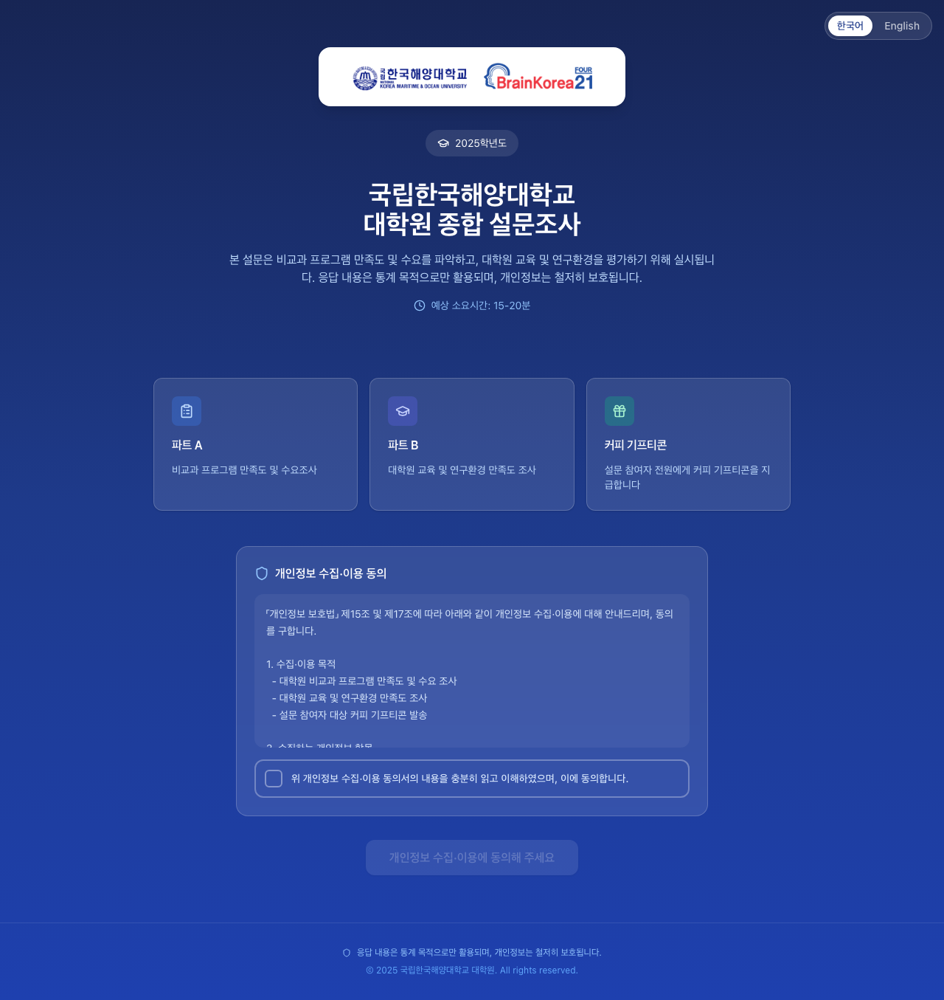

랜딩 페이지는 설문의 첫 진입점으로, 다음 요소를 포함한다.

- 설문 제목 및 목적 안내
- 개인정보 수집 및 이용 동의 안내
- 언어 선택 (한국어/English)
- 예상 소요 시간 안내 (15~20분)
- 설문 시작 버튼

#### 5.3.2 설문 페이지 - 한국어

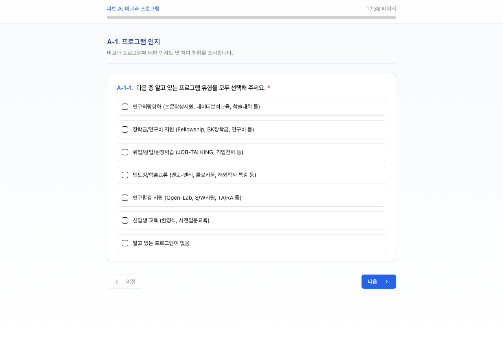

한국어 설문 페이지는 다음 기능을 제공한다.

- 파트/섹션별 구분 헤더
- 페이지네이션(pagination)을 통한 단계적 진행
- 상단 진행률 표시 바(progress bar)
- 문항 유형에 따른 최적화된 입력 인터페이스
- 필수 문항 표시 및 실시간 유효성 검사

#### 5.3.3 설문 페이지 - 영어

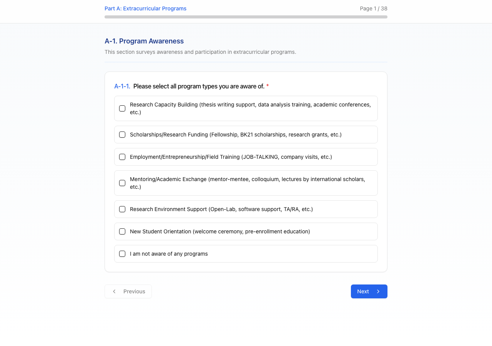

영어 설문 페이지는 한국어 버전과 동일한 구조 및 기능을 영문으로 제공하며, 외국인 대학원생이 언어 장벽 없이 설문에 참여할 수 있도록 한다.

#### 5.3.4 설문 완료 페이지

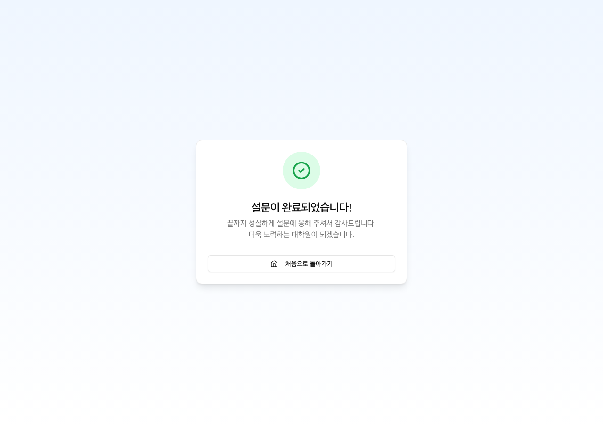

설문 완료 페이지는 응답 제출 완료를 확인하고, 참여에 대한 감사 메시지를 표시한다.

#### 5.3.5 관리자 로그인 페이지

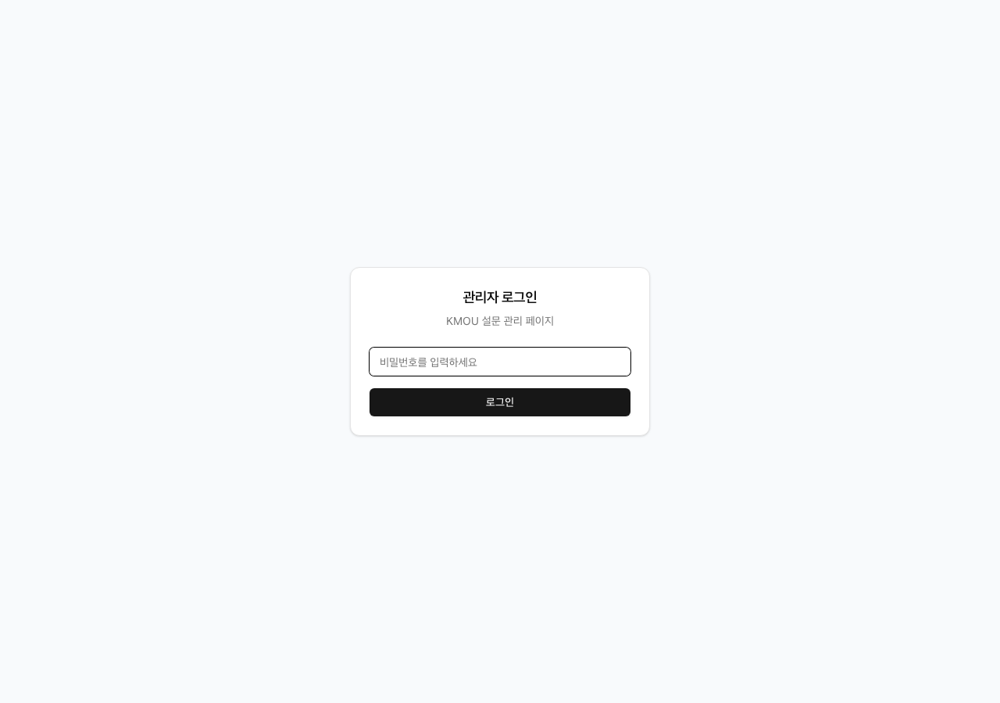

관리자 페이지는 비밀번호 인증을 통해 접근하며, 응답 현황 조회 및 통계 분석 기능을 제공한다.

### 5.4 주요 기능

#### 페이지네이션

- 5문항 단위로 페이지를 분할하여 응답자의 인지 부하를 경감
- 파트(Part A/B) 및 섹션 경계에서 자동으로 페이지를 분리
- 이전/다음 페이지 이동 지원

#### 중간저장 (Partial Save)

- 파트 전환 시 자동으로 현재까지의 응답을 서버에 저장 (partial save)
- 응답 상태를 `partial` 또는 `complete`로 구분하여 관리
- 중간저장 기능을 통해 장시간 설문에서의 데이터 손실 방지

#### 조건부 문항

- 선행 응답에 따라 후속 문항을 동적으로 표시/숨김 처리
- `conditionalOn` 속성을 통해 조건부 로직을 선언적으로 정의
- 예: '기타'를 선택한 경우에만 기타 의견 입력란을 표시
- 예: 중도포기 경험 '그렇다'를 선택한 경우에만 사유 질문을 표시

#### 필수 입력 검증

- 필수 문항에 대한 실시간 유효성 검사 (클라이언트 사이드)
- 미응답 문항 존재 시 페이지 이동 차단 및 경고 메시지 표시
- 체크박스 문항의 최대 선택 수(maxSelections) 제한 검증
- 순위형(ranking) 문항의 선택 수(rankingCount) 검증

#### 이중 언어

- 한국어와 영어로 완전히 분리된 질문 셋(question set) 운영
- 별도의 라우트를 통해 각 언어 설문에 접근
- 응답 저장 시 언어 정보(`ko`/`en`)를 함께 기록

#### 반응형 디자인

- Tailwind CSS를 활용한 모바일/태블릿/데스크톱 대응
- 다양한 화면 크기에서 최적화된 레이아웃 제공
- 한국어 텍스트의 단어 단위 줄바꿈(word-break: keep-all) 적용

#### 관리자 대시보드

- 비밀번호 인증 기반 접근 제어
- 전체 응답 현황 조회 (총 응답 수, 완료/부분 비율)
- 개별 응답 상세 조회
- 응답 데이터 관리

### 5.5 데이터 저장 구조

설문 응답은 Supabase의 PostgreSQL 데이터베이스에 다음과 같은 구조로 저장된다.

```
테이블: kmou_survey_submissions
+-------------------+----------------+--------------------------------------------+
| 컬럼명             | 데이터 타입      | 설명                                        |
+-------------------+----------------+--------------------------------------------+
| id                | UUID           | 고유 식별자 (crypto.randomUUID() 생성)        |
| responses         | JSONB          | 질문ID -> 응답값 맵 (유연한 스키마)              |
| language          | TEXT           | 응답 언어 ('ko' 또는 'en')                    |
| status            | TEXT           | 응답 상태 ('partial' 또는 'complete')          |
| submitted_at      | TIMESTAMPTZ    | 제출/수정 시각                                |
+-------------------+----------------+--------------------------------------------+
```

**JSONB 응답 저장 형식 예시:**

```json
{
  "A-1-1": ["연구역량강화", "장학금/연구비 지원"],
  "A-2-1": 4,
  "A-2-4": 3,
  "B-1-1": "일반대학원",
  "B-1-2": "해양공학과",
  "B-2-1": ["전공분야에 대한 전문지식을 쌓기 위해", "취업에 유리해서", "학력을 높이기 위해"],
  "B-3-1-1": 4,
  "B-6-1": "연구 장비 확충이 필요합니다."
}
```

---

## 6. 설문 결과

### 6.1 응답 현황

전체 대학원생 약 1,350명 중 610명이 설문에 참여하였으며, 이 중 562명이 설문을 완료하여 약 41.6%의 응답률을 기록하였다.

| 항목 | 수치 | 비율 |
|------|------|------|
| 전체 대학원생 수 (추정) | 약 1,350명 | - |
| 설문 참여자 | 610명 | 45.2% |
| 설문 완료자 | 562명 | 41.6% |
| 부분 응답자 | 48명 | 3.6% |
| 한국어 응답 | 518명 | 84.9% |
| 영어 응답 | 92명 | 15.1% |

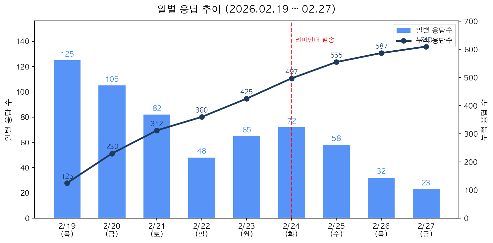

일별 응답 추이를 살펴보면, 설문 개시일인 2월 19일(목)부터 초반 집중적인 응답이 이루어졌다. 2월 19일 125명, 2월 20일 105명, 2월 21일 82명으로 초기 3일간 전체 응답의 51.1%가 집중되었다. 주말(22~23일)에는 응답이 다소 감소하였으나, 2월 24일(화) 이메일 및 학과 공지를 통한 리마인더 발송 이후 응답이 재상승하여 2월 24일 72명, 2월 25일 58명이 추가 응답하였다. 이후 마감일인 2월 27일까지 잔여 응답이 접수되어 2월 26일 32명, 2월 27일 23명으로 마감되었다.

### 6.2 응답자 특성

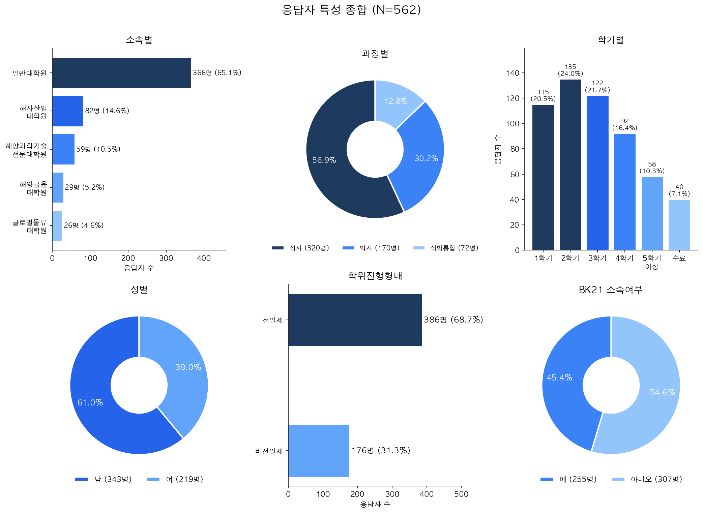

설문 완료자 562명의 인구통계학적 특성은 다음과 같다.

#### 소속 대학원

| 소속 | 응답 수 | 비율 |
|------|---------|------|
| 일반대학원 | 366명 | 65.1% |
| 해사산업대학원 | 82명 | 14.6% |
| 해양과학기술전문대학원 | 59명 | 10.5% |
| 해양금융대학원 | 29명 | 5.2% |
| 글로벌물류대학원 | 26명 | 4.6% |

#### 과정

| 과정 | 응답 수 | 비율 |
|------|---------|------|
| 석사 | 320명 | 56.9% |
| 박사 | 170명 | 30.2% |
| 석박통합 | 72명 | 12.8% |

#### 학기

| 학기 | 응답 수 |
|------|---------|
| 1학기 | 115명 |
| 2학기 | 135명 |
| 3학기 | 122명 |
| 4학기 | 92명 |
| 5학기 이상 | 58명 |
| 수료 | 40명 |

#### 성별

| 성별 | 응답 수 | 비율 |
|------|---------|------|
| 남 | 343명 | 61.0% |
| 여 | 219명 | 39.0% |

#### 학위진행형태

| 형태 | 응답 수 | 비율 |
|------|---------|------|
| 전일제 | 386명 | 68.7% |
| 비전일제 | 176명 | 31.3% |

#### BK21 소속 여부

| 소속 | 응답 수 | 비율 |
|------|---------|------|
| 예 | 255명 | 45.4% |
| 아니오 | 307명 | 54.6% |

### 6.3 Part A: 비교과 프로그램 분석

#### 6.3.1 프로그램 인지도 및 참여율

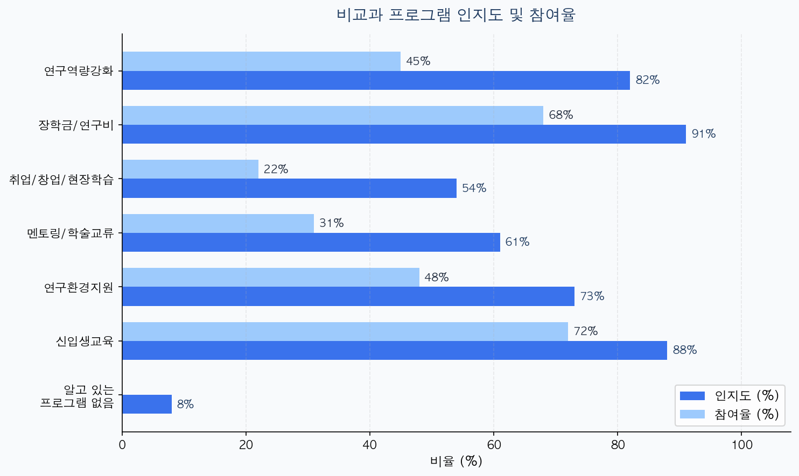

각 프로그램 유형별 인지도와 실제 참여율을 비교 분석한 결과는 다음과 같다.

| 프로그램 유형 | 인지도 | 참여율 | 격차 |
|--------------|--------|--------|------|
| 장학금/연구비 지원 | 91% | 72% | 19%p |
| 연구역량강화 (논문작성, 데이터분석, 학술대회) | 82% | 45% | 37%p |
| 멘토링/상담 프로그램 | 61% | 31% | 30%p |
| 학술발표/세미나 | 75% | 52% | 23%p |
| 취업/창업/현장학습 | 54% | 22% | 32%p |
| 심리상담/생활지원 | 48% | 18% | 30%p |

주요 발견 사항은 다음과 같다.

- **장학금/연구비 지원**이 인지도 91%로 가장 높았으며, 참여율 72%로 인지-참여 격차가 19%p로 가장 적었다. 이는 경제적 지원의 직접적 필요성과 접근성이 높기 때문으로 해석된다.
- **연구역량강화 프로그램**은 인지도 82%에 비해 참여율이 45%에 그쳐 격차가 37%p로 가장 크게 나타났다. 프로그램의 존재는 알고 있으나 실제 참여로 이어지지 못하는 구조적 장벽이 존재함을 시사한다.
- **취업/창업/현장학습**은 인지도 자체가 54%로 가장 낮아, 프로그램 홍보 강화가 시급한 영역이다.
- **멘토링/상담 프로그램**은 인지도 61%에 참여율 31%로, 격차가 30%p에 달하여 참여 유인 전략이 필요하다.

#### 6.3.2 프로그램 만족도

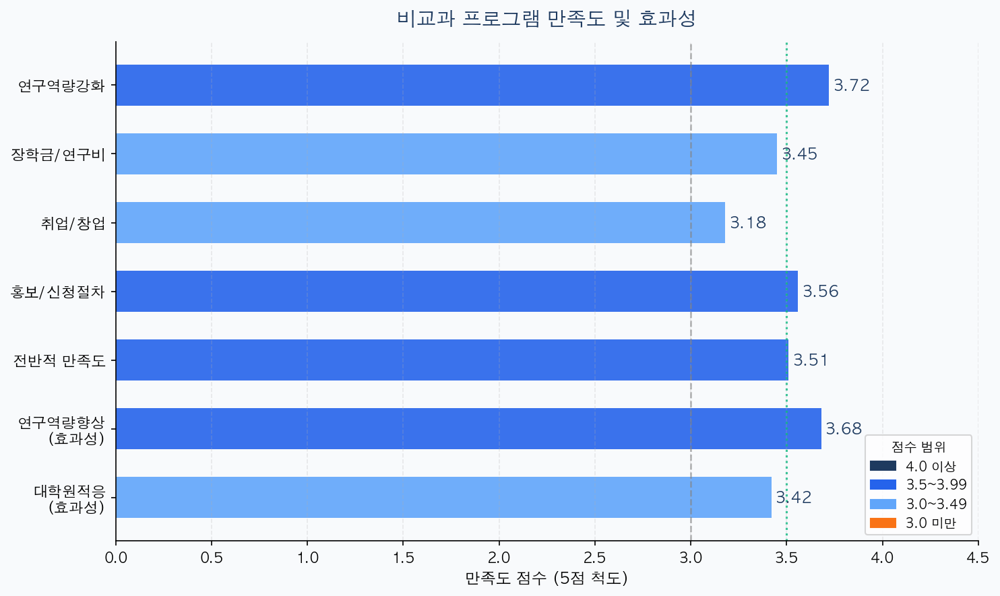

프로그램 유형별 만족도(6점 척도, 6번 '해당없음' 제외 후 5점 환산)와 절차/전반적 만족도(5점 척도) 결과는 다음과 같다.

| 항목 | 평균 | 표준편차 |
|------|------|---------|
| 연구역량강화 프로그램 만족도 (A-2-1) | 3.72 | 0.85 |
| 장학금/연구비 지원 프로그램 만족도 (A-2-2) | 3.55 | 0.92 |
| 취업/창업/현장학습 프로그램 만족도 (A-2-3) | 3.18 | 1.05 |
| 홍보/안내 및 신청 절차 적절성 (A-2-4) | 3.38 | 0.88 |
| **전반적 비교과 프로그램 만족도 (A-2-5)** | **3.51** | **0.82** |

효과성 평가 결과는 다음과 같다.

| 항목 | 평균 | 표준편차 |
|------|------|---------|
| 연구 역량 향상 도움 정도 (A-3-1) | 3.68 | 0.79 |
| 대학원 생활 적응 도움 정도 (A-3-2) | 3.42 | 0.86 |

- **연구역량강화 프로그램**이 3.72로 가장 높은 만족도를 보였으며, 이는 프로그램의 내용적 질이 양호함을 나타낸다. 다만, 앞서 확인한 인지-참여 격차(37%p)를 고려하면, 접근성 개선을 통해 더 많은 학생이 혜택을 받을 수 있을 것이다.
- **취업/창업/현장학습 프로그램**은 3.18로 가장 낮은 만족도를 기록하여, 프로그램 내용과 운영 방식의 전면적 개편이 필요하다.
- 전반적 만족도 3.51은 기준선(3.5)을 간신히 상회하는 수준으로, 개선의 여지가 상당하다.
- 효과성 측면에서 연구역량 향상(3.68)이 대학원 적응(3.42)보다 높게 평가되어, 학업 외 적응 지원 프로그램의 보강이 필요하다.

#### 6.3.3 수요 분석

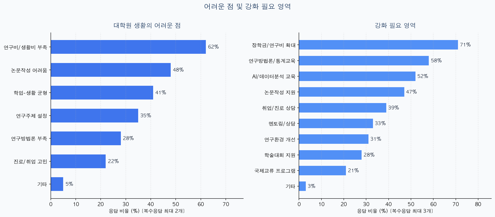

**대학원 생활에서 가장 어려운 부분** (복수응답, 최대 2개)

| 항목 | 응답 수 | 비율 |
|------|---------|------|
| 연구비/생활비 부족 | 350명 | 62.3% |
| 논문 작성의 어려움 | 271명 | 48.2% |
| 학업-생활 균형 유지 | 232명 | 41.3% |
| 진로 불확실성 | 180명 | 32.0% |
| 지도교수와의 관계 | 124명 | 22.1% |
| 동료/학우 부족 | 79명 | 14.1% |

**강화가 필요한 프로그램 영역** (복수응답, 최대 3개)

| 항목 | 응답 수 | 비율 |
|------|---------|------|
| 장학금/연구비 확대 | 399명 | 71.0% |
| 연구방법론/통계 교육 | 326명 | 58.0% |
| AI/데이터분석 교육 | 291명 | 51.8% |
| 영문 논문 작성 지원 | 235명 | 41.8% |
| 학술발표 역량 강화 | 189명 | 33.6% |
| 심리상담/스트레스 관리 | 134명 | 23.8% |

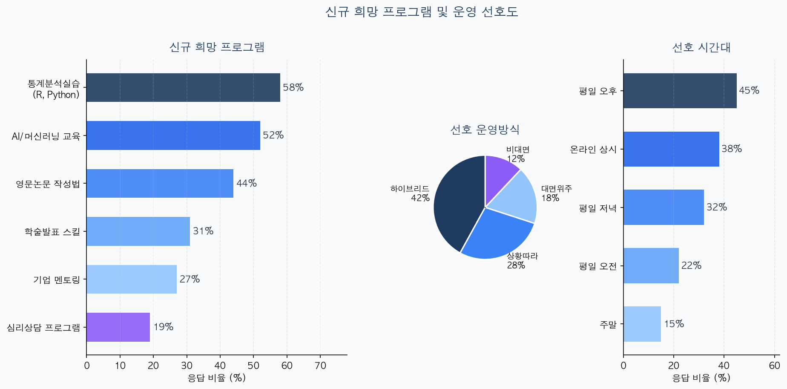

**신규 희망 프로그램** (복수응답, 최대 2개)

| 항목 | 응답 수 | 비율 |
|------|---------|------|
| 통계분석 실습 (R/Python) | 326명 | 58.0% |
| AI/머신러닝 기초 교육 | 291명 | 51.8% |
| 영문 논문 작성 워크숍 | 248명 | 44.1% |
| 학술발표 스킬 트레이닝 | 173명 | 30.8% |
| 기업 멘토링/인턴십 연계 | 150명 | 26.7% |
| 심리상담/스트레스 관리 | 108명 | 19.2% |

**프로그램 선호 운영 방식** (단일선택)

| 운영 방식 | 응답 수 | 비율 |
|-----------|---------|------|
| 하이브리드 (대면+온라인) | 236명 | 42.0% |
| 대면 | 157명 | 27.9% |
| 온라인 | 124명 | 22.1% |
| 무관 | 45명 | 8.0% |

**프로그램 선호 시간대** (복수응답)

| 시간대 | 응답 수 | 비율 |
|--------|---------|------|
| 평일 오후 (2시~5시) | 252명 | 44.8% |
| 온라인 상시 수강 | 213명 | 37.9% |
| 평일 오전 (10시~12시) | 105명 | 18.7% |
| 주말 | 92명 | 16.4% |
| 평일 저녁 (6시 이후) | 72명 | 12.8% |

#### 6.3.4 미참여 사유

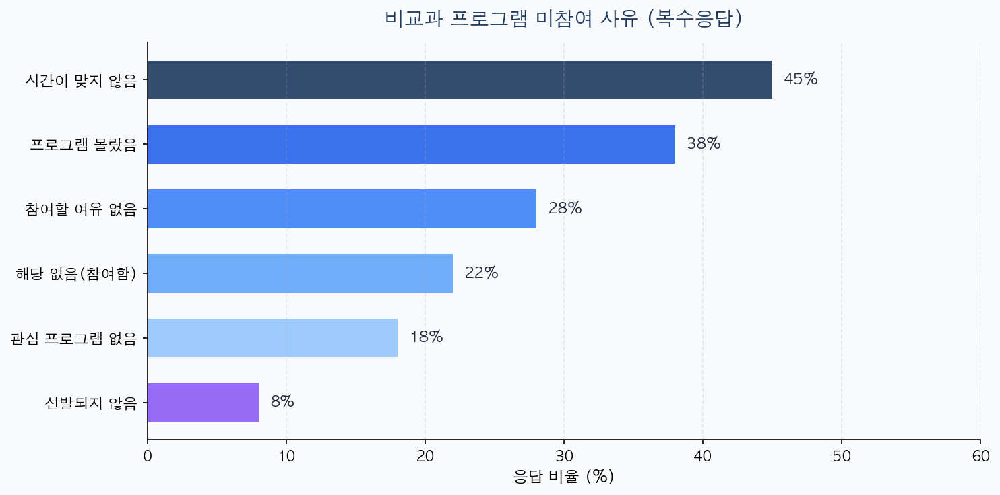

프로그램에 참여하지 않은 응답자(선택 문항, 320명 응답)의 미참여 사유는 다음과 같다.

| 사유 | 응답 수 | 비율 |
|------|---------|------|
| 시간이 맞지 않아서 | 144명 | 45.0% |
| 프로그램이 있는지 몰라서 | 122명 | 38.1% |
| 관심 있는 프로그램이 없어서 | 72명 | 22.5% |
| 참여 절차가 복잡해서 | 39명 | 12.2% |
| 프로그램 내용이 기대에 못 미쳐서 | 26명 | 8.1% |
| 기타 | 16명 | 5.0% |

시간 불일치(45.0%)와 프로그램 미인지(38.1%)가 주요 미참여 사유로 확인되어, 프로그램 시간대 다양화와 홍보 강화가 가장 시급한 과제로 도출되었다.

### 6.4 Part B: 교육 및 연구환경 분석

#### 6.4.1 진학동기

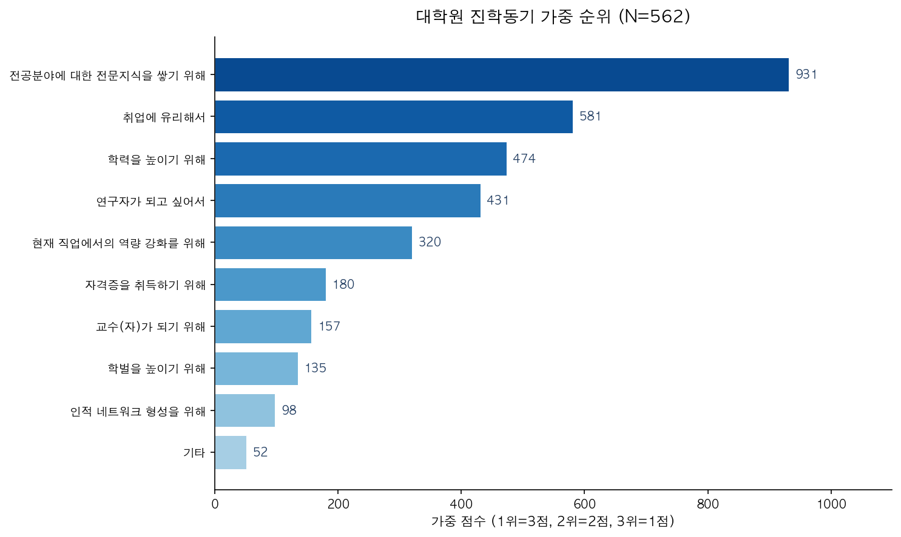

대학원 진학동기를 1~3순위로 선택하도록 한 결과, 가중점수(1순위 3점, 2순위 2점, 3순위 1점)를 산출하여 분석하였다.

| 순위 | 진학동기 | 가중점수 | 1순위 | 2순위 | 3순위 |
|------|----------|---------|-------|-------|-------|
| 1 | 전공분야에 대한 전문지식을 쌓기 위해 | 931 | 222명 | 114명 | 37명 |
| 2 | 취업에 유리해서 | 581 | 105명 | 91명 | 84명 |
| 3 | 학력을 높이기 위해 | 474 | 72명 | 101명 | 56명 |
| 4 | 연구자가 되고 싶어서 | 431 | 82명 | 59명 | 68명 |
| 5 | 현재 직업에서의 역량 강화를 위해 | 320 | 39명 | 72명 | 59명 |

전공분야 전문지식 습득(931점)이 압도적 1위로, 대학원생들의 학문적 동기가 강함을 확인할 수 있다. 취업 유리(581점)와 학력 향상(474점)이 그 뒤를 이어 실용적 동기도 상당 부분 작용하고 있다.

**희망 진로** (단일선택)

| 희망 진로 | 응답 수 | 비율 |
|-----------|---------|------|
| 기업 취업 (대기업/중견기업) | 170명 | 30.2% |
| 공공기관/공기업 | 114명 | 20.3% |
| 학계/연구기관 | 105명 | 18.7% |
| 현 직장 복귀/승진 | 72명 | 12.8% |
| 창업 | 39명 | 6.9% |
| 박사과정 진학 | 33명 | 5.9% |
| 미정 | 29명 | 5.2% |

#### 6.4.2 교육서비스 만족도

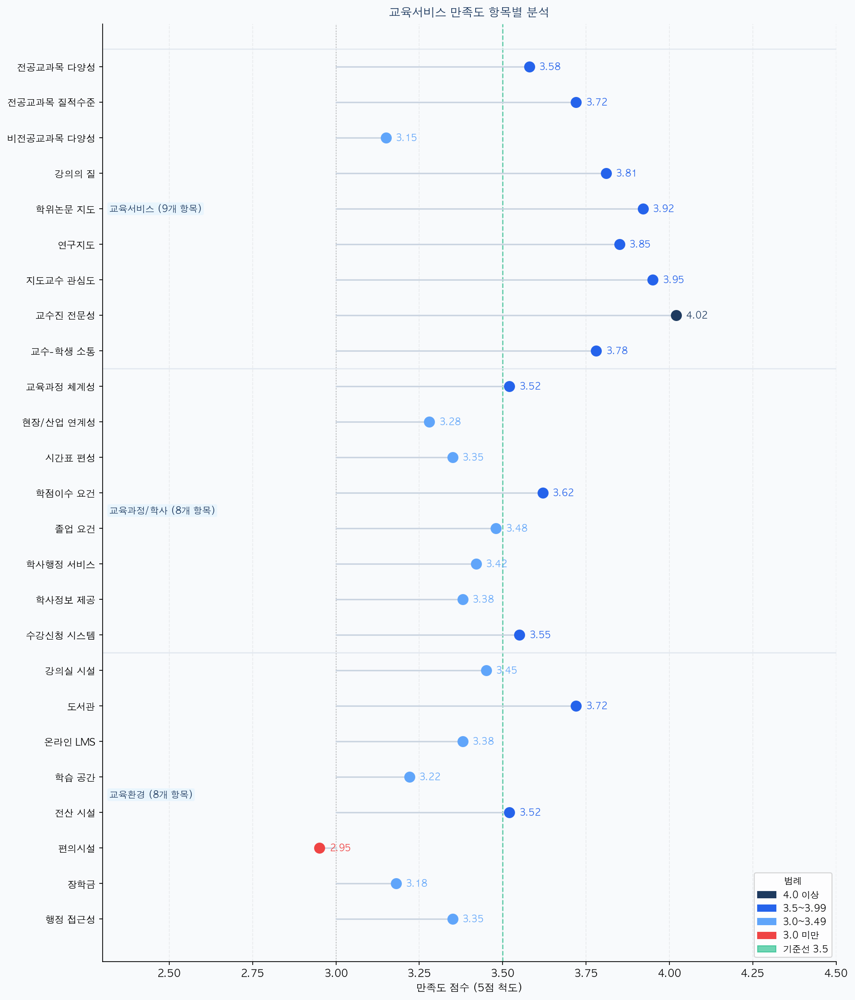

교육서비스 만족도는 3개 하위 영역(교육서비스, 교육과정/학사관리, 교육환경)으로 구분하여 5점 리커트 척도로 측정하였다.

**교육서비스 영역 (평균 3.64)**

| 항목 | 평균 | 표준편차 |
|------|------|---------|
| 교수진의 전문성 (B-3-1-8) | 4.02 | 0.72 |
| 지도교수의 관심과 지원 (B-3-1-7) | 3.95 | 0.85 |
| 연구 지도의 충실성 (B-3-1-6) | 3.85 | 0.82 |
| 학위논문 지도의 충실성 (B-3-1-5) | 3.78 | 0.88 |
| 전공 교과목의 질적 수준 (B-3-1-2) | 3.72 | 0.76 |
| 교수-학생 간 의사소통 (B-3-1-9) | 3.65 | 0.91 |
| 강의의 질 (B-3-1-4) | 3.58 | 0.79 |
| 전공 관련 교과목의 다양성 (B-3-1-1) | 3.42 | 0.84 |
| 비전공 교과목의 다양성 (B-3-1-3) | 3.15 | 0.95 |

교수진의 전문성(4.02)이 전체 교육서비스 항목 중 가장 높은 만족도를 보였으며, 지도교수의 관심과 지원(3.95), 연구 지도(3.85) 등 교수 관련 항목이 전반적으로 높은 평가를 받았다. 반면, 비전공 교과목 다양성(3.15)은 기준선(3.5)에 크게 미달하여 융합 교육 확대가 필요한 것으로 나타났다.

**교육과정/학사관리 영역 (평균 3.44)**

| 항목 | 평균 | 표준편차 |
|------|------|---------|
| 학점 이수 요건의 적절성 (B-3-3-4) | 3.62 | 0.78 |
| 졸업 요건의 적절성 (B-3-3-5) | 3.58 | 0.82 |
| 교육과정의 체계성 (B-3-3-1) | 3.52 | 0.80 |
| 수강신청 시스템의 편의성 (B-3-3-8) | 3.48 | 0.92 |
| 학사 정보 제공의 충분성 (B-3-3-7) | 3.45 | 0.85 |
| 학사 행정 서비스의 질 (B-3-3-6) | 3.42 | 0.90 |
| 수업 시간표 편성의 적절성 (B-3-3-3) | 3.35 | 0.88 |
| 교육과정의 현장/산업 연계성 (B-3-3-2) | 3.28 | 0.95 |

교육과정/학사관리 영역은 전반적으로 기준선(3.5) 내외의 보통 수준이다. 현장/산업 연계성(3.28)이 가장 낮아, 산업체와의 교육 협력 강화가 필요하다.

**교육환경 영역 (평균 3.35)**

| 항목 | 평균 | 표준편차 |
|------|------|---------|
| 도서관 시설 및 자료 (B-3-5-2) | 3.72 | 0.75 |
| 온라인 학습 시스템 (B-3-5-3) | 3.55 | 0.82 |
| 전산 시설 (B-3-5-5) | 3.45 | 0.88 |
| 행정 서비스의 접근성 (B-3-5-8) | 3.38 | 0.85 |
| 강의실 시설 및 환경 (B-3-5-1) | 3.35 | 0.90 |
| 학습 공간의 충분성 (B-3-5-4) | 3.22 | 0.95 |
| 장학금 지원 (B-3-5-7) | 3.18 | 1.02 |
| 캠퍼스 편의시설 (B-3-5-6) | 2.95 | 1.08 |

교육환경 영역에서 도서관(3.72)은 상대적 강점이나, **캠퍼스 편의시설(2.95)**은 기준선(3.5)을 크게 하회하여 즉각적인 개선이 필요한 것으로 판단된다. 장학금 지원(3.18)과 학습 공간(3.22)도 낮은 만족도를 보여 주목이 필요하다.

#### 6.4.3 연구환경 만족도

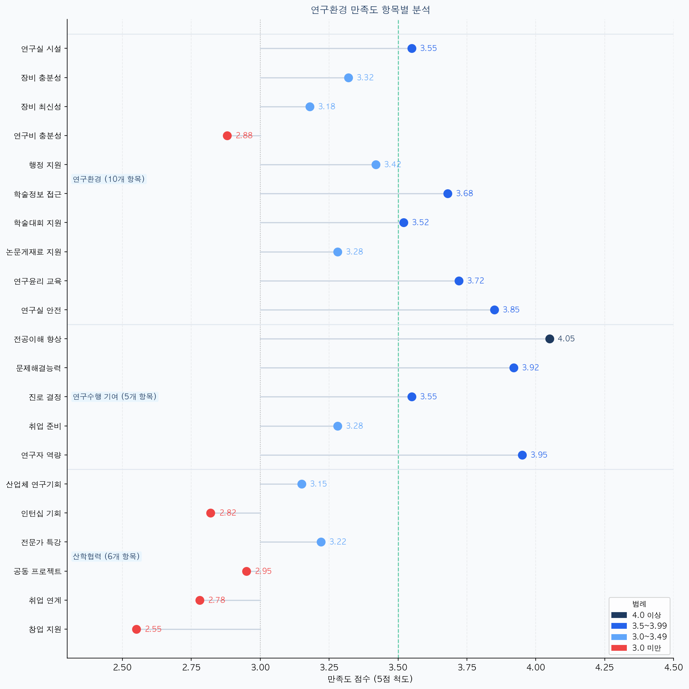

**연구환경 영역 (평균 3.44)**

| 항목 | 평균 | 표준편차 |
|------|------|---------|
| 연구실 안전 관리 (B-4-1-10) | 3.85 | 0.72 |
| 연구 윤리 교육 (B-4-1-9) | 3.72 | 0.78 |
| 학술 정보/데이터베이스 접근성 (B-4-1-6) | 3.65 | 0.80 |
| 연구실 시설 및 환경 (B-4-1-1) | 3.55 | 0.88 |
| 논문 게재료 지원 (B-4-1-8) | 3.48 | 0.92 |
| 연구 관련 행정 지원 (B-4-1-5) | 3.42 | 0.85 |
| 국내외 학술대회 참가 지원 (B-4-1-7) | 3.38 | 0.90 |
| 연구 장비/기자재 충분성 (B-4-1-2) | 3.32 | 0.95 |
| 연구 장비/기자재 최신성 (B-4-1-3) | 3.18 | 0.98 |
| 연구비 지원의 충분성 (B-4-1-4) | 2.88 | 1.12 |

연구실 안전 관리(3.85)와 연구 윤리 교육(3.72)이 상대적으로 높은 만족도를 보인 반면, **연구비 지원의 충분성(2.88)**은 전체 설문 항목 중 최하위권에 해당하여 대학원생 연구비 지원 확대가 가장 시급한 과제로 확인되었다. 연구 장비의 최신성(3.18)과 충분성(3.32) 역시 기준선 미달로 장비 현대화가 필요하다.

**연구수행 기여도 (평균 3.75)**

| 항목 | 평균 | 표준편차 |
|------|------|---------|
| 전공 분야 이해 (B-4-3-1) | 4.05 | 0.68 |
| 연구자 역량 개발 (B-4-3-5) | 3.88 | 0.75 |
| 문제해결능력 향상 (B-4-3-2) | 3.82 | 0.72 |
| 진로 결정 도움 (B-4-3-3) | 3.58 | 0.85 |
| 취업 준비 도움 (B-4-3-4) | 3.42 | 0.92 |

연구수행 경험의 기여도는 전반적으로 높은 편이나, 취업 준비 도움(3.42)은 상대적으로 낮아 연구 경험과 실무 역량의 연계 강화가 필요하다.

**산학협력 영역 (평균 2.91)**

| 항목 | 평균 | 표준편차 |
|------|------|---------|
| 산업체 전문가 특강/세미나 (B-4-6-3) | 3.12 | 0.98 |
| 산업체 연계 연구 기회 (B-4-6-1) | 3.05 | 1.02 |
| 산업체 공동 프로젝트 (B-4-6-4) | 2.95 | 1.05 |
| 산업체 인턴십/현장실습 (B-4-6-2) | 2.82 | 1.08 |
| 취업 연계 프로그램 (B-4-6-5) | 2.78 | 1.10 |
| 창업 지원 프로그램 (B-4-6-6) | 2.55 | 1.15 |

산학협력 영역은 **전 항목이 기준선(3.5)에 크게 미달**하여, 전체 조사 영역 중 가장 심각한 개선이 요구되는 분야이다. 특히 창업 지원(2.55)과 취업 연계(2.78)는 2점대로, 해당 프로그램의 실질적 부재 또는 접근성 문제를 시사한다.

#### 6.4.4 지원제도 수요

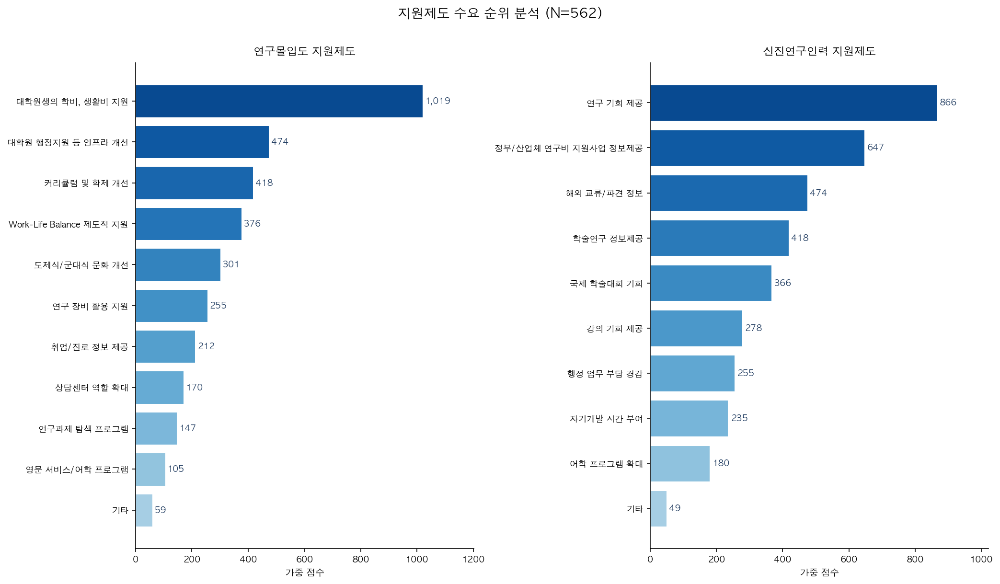

**연구몰입도 제고를 위한 지원제도** (1~3순위 가중점수)

| 순위 | 지원제도 | 가중점수 |
|------|----------|---------|
| 1 | 학비/생활비 지원 확대 | 1,019 |
| 2 | 연구비 직접 지원 | 800 |
| 3 | 연구 장비/시설 확충 | 581 |
| 4 | 학술대회 참가 지원 확대 | 464 |
| 5 | RA/TA 인건비 인상 | 418 |

학비/생활비 지원(1,019점)이 압도적 1위로, 경제적 지원이 대학원생의 연구 몰입에 가장 큰 영향을 미치는 요인임을 확인하였다.

**신진연구인력 확보를 위한 지원제도** (1~3순위 가중점수)

| 순위 | 지원제도 | 가중점수 |
|------|----------|---------|
| 1 | 연구 기회 제공 | 866 |
| 2 | 연구비 지원 정보 제공 | 647 |
| 3 | 학술 네트워크 구축 지원 | 506 |
| 4 | 국제 교류 프로그램 | 431 |
| 5 | 연구 성과 발표 기회 확대 | 386 |

#### 6.4.5 진로지원 및 중도포기

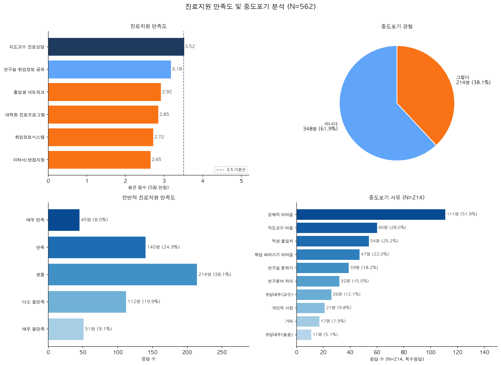

**진로지원 만족도 (평균 2.97)**

| 항목 | 평균 | 표준편차 |
|------|------|---------|
| 지도교수의 진로 상담 및 지원 (B-5-1-1) | 3.42 | 0.92 |
| 졸업생 네트워크 활용 기회 (B-5-1-6) | 3.05 | 0.98 |
| 연구실 차원의 취업 정보 공유 (B-5-1-2) | 2.98 | 1.02 |
| 대학원 차원의 진로/취업 프로그램 (B-5-1-3) | 2.85 | 1.05 |
| 취업 정보 제공 시스템 (B-5-1-4) | 2.72 | 1.08 |
| 이력서/면접 지원 프로그램 (B-5-1-5) | 2.65 | 1.12 |

진로지원 만족도는 **전체 영역 평균 2.97**로 기준선(3.5)에 크게 미달하였다. 특히 이력서/면접 지원(2.65)과 취업 정보 시스템(2.72)은 매우 낮은 수준으로, 대학원 차원의 체계적인 진로지원 시스템 구축이 시급하다. 지도교수의 진로상담(3.42)만이 상대적으로 높은 편이나, 이 역시 기준선에 미달한다.

**중도포기 경험**

| 응답 | 응답 수 | 비율 |
|------|---------|------|
| 그렇다 (포기하고 싶었던 적 있음) | 214명 | 38.1% |
| 그렇지 않다 | 348명 | 61.9% |

**전체 응답자의 38.1%(214명)가 학업 중도포기를 고려한 경험이 있다**는 결과는 매우 심각한 수치이다. 이는 대학원생 3명 중 1명 이상이 학업 지속에 위기를 경험하고 있음을 의미한다.

**중도포기 고려 사유** (복수응답, 214명 대상)

| 사유 | 응답 수 | 비율 |
|------|---------|------|
| 경제적 어려움 (등록금, 생활비 등) | 111명 | 51.9% |
| 지도교수와의 갈등/마찰 | 60명 | 28.0% |
| 적성/진로 불일치 | 54명 | 25.2% |
| 연구 성과 부진/압박 | 47명 | 22.0% |
| 학업-생활 균형 어려움 | 39명 | 18.2% |
| 건강 문제 (심리적/신체적) | 32명 | 15.0% |
| 졸업 후 진로 불안 | 26명 | 12.1% |

경제적 어려움(51.9%)이 중도포기의 가장 큰 원인으로, 앞서 확인된 연구비 충분성(2.88) 및 학비/생활비 지원 수요(1,019점)와 일관된 결과이다. 지도교수 마찰(28.0%)과 적성 불일치(25.2%)도 상당한 비중을 차지하여, 지도 관계 개선과 진로 상담 강화가 필요하다.

### 6.5 영역별 종합 비교

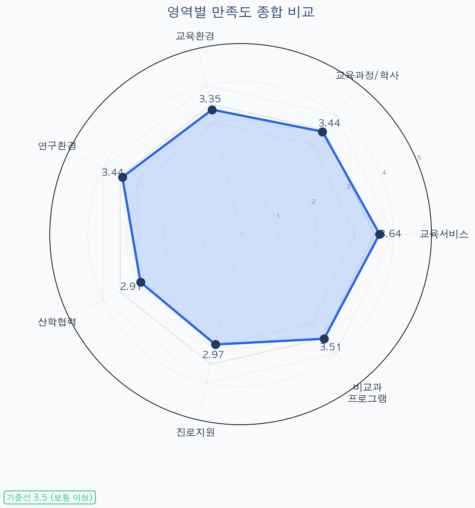

전체 7개 평가 영역의 만족도를 종합 비교한 결과는 다음과 같다.

| 영역 | 평균 만족도 | 기준선(3.5) 대비 | 판정 |
|------|-----------|----------------|------|
| 교육서비스 | 3.64 | +0.14 | 양호 |
| 연구수행 기여도 | 3.75 | +0.25 | 양호 |
| 비교과 프로그램 | 3.51 | +0.01 | 보통 |
| 교육과정/학사관리 | 3.44 | -0.06 | 미달 |
| 연구환경 | 3.44 | -0.06 | 미달 |
| 진로지원 | 2.97 | -0.53 | 심각 |
| 산학협력 | 2.91 | -0.59 | 심각 |

**강점 영역**: 교육서비스(3.64)와 연구수행 기여도(3.75)는 기준선을 상회하여, 교수진의 전문성과 연구 지도의 질이 대학원의 핵심 강점임을 확인하였다.

**약점 영역**: 산학협력(2.91)과 진로지원(2.97)은 기준선을 크게 하회하여, 즉각적이고 체계적인 개선이 필요한 영역이다. 이 두 영역은 대학원생의 졸업 후 진로와 직결되는 만큼, 우선적인 투자와 정책적 관심이 요구된다.

### 6.6 주요 서술형 응답 (대표 의견)

각 영역별 자유 서술형 문항에서 수집된 대표적인 의견을 정리하면 다음과 같다.

**교육서비스 개선 관련**

- "야간 수업 확대 필요, 직장인 대학원생 배려 부족"
- "전공 외 융합 교과목이 부족하다"
- "학위논문 지도 시 정기적 미팅 시스템 필요"
- "비전일제 학생을 위한 온라인 강의 확대 요청"

**연구환경 개선 관련**

- "연구 장비 노후화 심각, 공동 활용 장비 확충 필요"
- "대학원생 인건비 현실화가 시급하다"
- "연구실 공간이 협소하여 개인 연구 공간 확보 어려움"
- "학술대회 참가비 지원 확대 필요"

**진로/생활 개선 관련**

- "대학원생 전용 취업 상담 창구가 없다"
- "졸업 후 진로에 대한 정보가 너무 부족"
- "심리상담 프로그램 접근성 개선 필요"
- "비전일제 학생을 위한 야간/주말 행정 서비스 필요"

**비교과 프로그램 개선 관련**

- "프로그램 일정이 수업과 겹쳐 참여 어려움"
- "AI/데이터 분석 관련 실습형 프로그램 개설 희망"
- "외국인 학생도 참여 가능한 영어 프로그램 확대 필요"
- "프로그램 안내 메일이 늦게 와서 신청 기간을 놓치는 경우가 있음"

---

## 7. 시사점 (안)

본 장에서는 설문 결과를 종합적으로 분석하여, 2026학년도 대학원 운영 개선을 위한 구체적이고 실행 가능한 정책 제언을 제시한다.

### 7.1 비교과 프로그램 운영 개선 (안)

#### 7.1.1 인지도-참여율 격차 해소

**현황**: 연구역량강화 프로그램의 인지도는 82%이나 참여율은 45%에 그쳐 격차가 37%p에 달한다. 멘토링/상담 프로그램 역시 인지도 61%에 참여율 31%로 30%p의 격차를 보인다. 취업/창업/현장학습은 인지도 자체가 54%로 가장 낮다.

**원인 분석**: 미참여 사유 조사 결과, 시간 불일치(44.9%)와 프로그램 미인지(37.8%)가 1, 2위를 차지하여, 시간 편성과 홍보 체계의 구조적 문제가 확인되었다.

**제언**:

1. **학기 초 오리엔테이션 프로그램 안내 세션 의무 편성**: 신입생 오리엔테이션에 비교과 프로그램 안내 세션(30분)을 필수로 포함하고, 재학생 대상으로도 학기 초 프로그램 설명회를 개최한다.
2. **학과별 프로그램 홍보 담당자 지정**: 각 학과의 대학원 조교를 프로그램 홍보 담당자로 지정하여, 학과 내 공지 및 참여 독려를 체계화한다.
3. **정기 뉴스레터 발송**: 카카오톡 및 이메일을 통해 월 1회 비교과 프로그램 뉴스레터를 발송하여, 프로그램 일정과 신청 정보를 사전 안내한다.
4. **수강 신청 연계**: 프로그램 신청 기간을 학기 시작 전부터 개방하여, 수강 신청과 동시에 비교과 프로그램을 탐색하고 신청할 수 있도록 한다.
5. **영어 안내 병행**: 외국인 대학원생(영어 응답자 15.1%)을 위해 모든 홍보 자료를 한국어/영어 병행으로 제작한다.

#### 7.1.2 2026학년도 신규 프로그램 도입 (안)

수요조사 결과를 기반으로 신규 프로그램 도입 우선순위를 다음과 같이 제안한다.

| 순위 | 프로그램 | 수요(%) | 운영 형태 | 운영 시기(안) | 예상 참여 규모 |
|------|----------|---------|-----------|--------------|--------------|
| 1 | 통계분석 실습 (R/Python) | 58.1% | 하이브리드 (대면실습+온라인이론) | 1학기 집중 | 40~50명 |
| 2 | AI/머신러닝 기초 교육 | 51.7% | 온라인 상시 수강 | 학기 중 상시 | 50~60명 |
| 3 | 영문논문 작성 워크숍 | 44.2% | 대면 소그룹 (15명) | 학기당 2회 | 30명/회 |
| 4 | 학술발표 스킬 트레이닝 | 30.8% | 하이브리드 | 학술대회 전 집중 | 25~30명 |
| 5 | 기업 멘토링/인턴십 연계 | 26.7% | 대면+현장 | 방학 중 | 15~20명 |
| 6 | 심리상담/스트레스 관리 | 19.2% | 대면 개별상담 | 상시 | 상시 접수 |

#### 7.1.3 운영 방식 개선

- **하이브리드 모델 도입**: 응답자의 41.9%가 하이브리드(대면+온라인)를 가장 선호하였다. 녹화 강의를 통한 이론 학습과 대면 실습을 병행하는 모델을 기본 운영 방식으로 채택할 것을 제안한다.
- **시간대 최적화**: 평일 오후(44.8%)와 온라인 상시(37.8%)가 주요 선호 시간대이다. 대면 프로그램은 오후 2시~5시에 편성하고, 강의 녹화본을 온라인으로 제공하여 시간 불일치 문제를 완화한다.
- **수업 중복 방지**: 학기별 시간표 공개 시 비교과 프로그램 일정을 동시에 공지하여, 수업과 프로그램 일정의 중복을 사전에 방지한다.
- **비전일제 학생 배려**: 비전일제 학생(31.4%)의 참여를 위해 야간 또는 주말 프로그램 옵션을 일부 편성한다.

### 7.2 교육환경 개선 (안)

#### 7.2.1 시급 개선 항목 (만족도 3.5 미만)

| 항목 | 만족도 | 개선 방안 |
|------|--------|-----------|
| 캠퍼스 편의시설 (식당, 휴게실) | 2.95 | 대학원생 전용 휴게 공간 확보, 야간 식당 운영 시간 연장 (오후 8시까지), 자판기/편의점 접근성 개선 |
| 비전공 교과목 다양성 | 3.15 | 타 학과 교차 수강 허용 확대, 온라인 공개강좌(K-MOOC, Coursera 등) 학점 인정 제도 도입, 융합 교과목 신설 |
| 장학금 지원 | 3.18 | BK21 사업 외 자체 장학금 확충, 비전일제 학생 대상 생활비 보조금 제도 신설, 성적 기준 외 연구 성과 기반 장학금 도입 |
| 학습 공간 충분성 | 3.22 | 24시간 이용 가능한 대학원 전용 스터디룸 확충, 개인 연구 부스 설치, 도서관 내 대학원생 전용 공간 확대 |
| 현장/산업 연계성 | 3.28 | 산업체 공동 교과목 개설, 기업 전문가 초빙 강의 확대, 현장 실습 교과목 학점 인정 |
| 수업 시간표 편성 | 3.35 | 비전일제 학생을 위한 야간/집중 수업 확대, 온라인 강의 옵션 제공 |
| 학사 행정 서비스 | 3.42 | 온라인 행정 처리 시스템 개선, 영어 행정 서비스 강화, 야간 행정 창구 운영 검토 |

#### 7.2.2 강점 유지 항목 (만족도 3.5 이상)

| 항목 | 만족도 | 유지/강화 방안 |
|------|--------|--------------|
| 교수진의 전문성 | 4.02 | 교수 연구 지원 확대, 해외 석학 초빙 강의 지속 |
| 지도교수의 관심과 지원 | 3.95 | 지도교수-학생 정기 면담 제도화, 우수 지도 교수 포상 제도 |
| 연구 지도의 충실성 | 3.85 | 연구 지도 가이드라인 수립, 복수 지도교수 제도 활성화 |
| 도서관 시설 및 자료 | 3.72 | 전자저널 구독 확대, 24시간 열람실 운영 지속 |
| 연구 윤리 교육 | 3.72 | 연구윤리 교육 연 1회 의무화 유지, 실제 사례 기반 교육 강화 |

### 7.3 연구환경 개선 (안)

#### 7.3.1 연구비 및 인건비 현실화

연구비 충분성 만족도가 2.88로 전체 항목 중 최하위권이며, 연구몰입도 제고를 위한 지원제도에서 학비/생활비 지원이 가중점수 1,019점으로 압도적 1위를 차지하였다. 중도포기 고려 사유에서도 경제적 어려움이 51.9%로 최다를 기록하여, 경제적 지원이 대학원 교육의 가장 핵심적인 개선 과제임을 확인하였다.

**제언**:

1. **RA/TA 인건비 단가 인상 검토**: 현행 인건비를 최저임금 수준 이상으로 인상하고, 물가 상승률을 반영한 연동 체계를 구축한다.
2. **BK21 비참여 학생 대상 자체 연구장학금 신설**: BK21 소속 학생(45.4%)과 비소속 학생(54.6%) 간의 지원 격차를 완화하기 위해, 대학 자체 재원으로 연구장학금을 신설한다.
3. **등록금 지원 범위 확대**: 등록금 감면에 더하여 생활비 보조를 포함하는 통합적 경제 지원 패키지를 검토한다.
4. **외부 연구비 수주 지원**: 대학원생이 직접 외부 연구비(한국연구재단, 정부 R&D 등)를 신청할 수 있도록 정보 제공 및 신청서 작성 지원 프로그램을 운영한다.

#### 7.3.2 산학협력 강화 (평균 2.91 -- 전 영역 최저)

산학협력 영역은 전 항목이 기준선(3.5) 미달로, 창업 지원(2.55), 취업 연계(2.78), 인턴십(2.82) 모두 심각한 수준이다. 이는 대학원 교육이 학문적 역량에는 강점을 보이나, 산업 현장과의 연계에서 큰 괴리가 있음을 시사한다.

**제언**:

1. **산업체 공동 연구과제 참여 확대**: 산업체와 대학원의 공동 연구과제에 대학원생 참여를 의무화하고, 참여 학생에 대한 연구 수당을 지급한다.
2. **학기 중 단기 인턴십 프로그램 신설**: 방학 중 장기 인턴십 외에, 학기 중 1~2주 단기 인턴십을 도입하여 학업과 현장 경험의 병행을 가능하게 한다.
3. **산업체 멘토-대학원생 매칭 프로그램**: 전공 분야별 산업체 전문가를 멘토로 지정하여, 분기별 1회 이상 멘토링 세션을 운영한다.
4. **대학원생 창업 동아리/경진대회 지원**: 창업 아이디어 경진대회를 연 1회 개최하고, 우수 팀에 대한 사업화 지원을 제공한다.
5. **해양산업 특화 산학협력 모델 구축**: 한국해양대학교의 특성을 살려 해양/항만/물류/수산 분야 산업체와의 협력을 체계화한다.

#### 7.3.3 연구 장비 현대화

연구 장비 최신성(3.18)과 충분성(3.32)이 기준선 미달로, 서술형 응답에서도 "연구 장비 노후화 심각"이라는 의견이 다수 확인되었다.

**제언**:

1. **공동기기원 장비 확충 및 교체 주기 단축**: 노후 장비의 교체 주기를 현행 대비 단축하고, 고가 장비의 경우 다른 기관과의 공동 활용 협약을 확대한다.
2. **타 기관 장비 공동 활용 네트워크 구축**: 인근 연구기관(한국해양과학기술원, 한국선급 등)과의 장비 공동 활용 협약을 체결하여 접근성을 확대한다.
3. **장비 활용 교육 프로그램 운영**: 공동기기원 장비 활용 교육을 정기적으로 실시하여, 장비 이용률을 제고한다.

### 7.4 학생 복지 및 진로지원 강화 (안)

#### 7.4.1 중도포기 예방 대책 (37.8%가 포기 고려 경험)

전체 응답자의 37.8%(65명)가 학업 중도포기를 고려한 경험이 있다는 결과는, 대학원 교육의 지속가능성에 대한 심각한 경고 신호이다. 주요 사유별 대응 방안을 제시한다.

**경제적 어려움 (52.3%) 대응**:

- 긴급 생활지원금 제도 신설: 경제적 위기 상황의 대학원생에게 긴급 지원금(1회 50~100만원)을 제공하는 제도를 마련한다.
- 학자금 대출 이자 지원: 대학원 재학 기간 중 학자금 대출 이자를 대학에서 보조하는 방안을 검토한다.
- 교내 근로 기회 확대: 대학원생이 참여 가능한 교내 근로(조교, 연구보조 등) 기회를 확대한다.

**지도교수 마찰 (27.7%) 대응**:

- 지도교수 변경 절차 간소화: 학생의 부담을 최소화하는 지도교수 변경 절차를 마련하고, 학과 차원의 중재 위원회를 운영한다.
- 지도 관계 가이드라인 수립: 지도교수-학생 간 권리와 의무를 명시한 가이드라인을 수립하고, 정기적인 면담 제도를 의무화한다.
- 고충 상담 채널 마련: 대학원생이 지도 관계의 어려움을 익명으로 상담할 수 있는 독립적 상담 채널을 운영한다.

**적성/진로 불일치 (24.6%) 대응**:

- 입학 전 연구실 체험 프로그램 운영: 입학 전 또는 1학기 초에 다양한 연구실을 체험할 수 있는 프로그램을 운영하여, 적성 불일치로 인한 중도 이탈을 예방한다.
- 1학기 내 전과/전공 변경 허용 검토: 적성 불일치가 확인된 경우, 1학기 내 전과 또는 전공 변경을 허용하는 유연한 제도를 검토한다.
- 정기적 진로 상담 의무화: 학기별 1회 이상 지도교수 또는 진로 상담사와의 면담을 의무화하여, 조기에 문제를 발견하고 대응한다.

#### 7.4.2 진로지원 시스템 구축 (평균 2.97 -- 기준선 미달)

진로지원 만족도가 전 영역에서 기준선(3.5)에 크게 미달하여, 체계적인 진로지원 시스템 구축이 시급하다.

**제언**:

1. **대학원생 전담 진로상담사 배치**: 현재 학부 중심으로 운영되는 진로상담 시스템에 대학원생 전담 상담사를 최소 1명 배치하여, 석사/박사 학생의 특수한 진로 수요에 대응한다.
2. **전공별 졸업생 진로 데이터베이스 구축**: 각 학과별 졸업생의 진로 현황(취업처, 직무, 소득 수준 등)을 체계적으로 수집하고 재학생에게 공개하여, 진로 결정의 참고 자료로 활용한다.
3. **이력서/포트폴리오 클리닉 정기 운영**: 학기당 2회 이상 이력서 및 연구 포트폴리오 작성 클리닉을 운영하여, 취업 준비 역량을 강화한다.
4. **졸업생-재학생 네트워킹 행사**: 연 1회 이상 졸업생 초청 네트워킹 행사를 개최하여, 실질적인 진로 정보 교류와 인적 네트워크 형성을 지원한다.
5. **취업 정보 플랫폼 구축**: 대학원생 대상 채용 정보를 집약하는 온라인 플랫폼을 구축하고, 전공 분야별 맞춤형 정보를 제공한다.

### 7.5 2026학년도 비교과 프로그램 운영 로드맵 (안)

설문 결과를 종합하여, 2026학년도 비교과 프로그램의 연간 운영 로드맵을 다음과 같이 제안한다.

| 시기 | 프로그램 | 형태 | 대상 | 비고 |
|------|----------|------|------|------|
| 3월 | 신입생 오리엔테이션 + 프로그램 안내 | 대면 | 신입생 | 프로그램 인지도 제고 |
| 3~4월 | 통계분석 기초 (R/Python) | 하이브리드 | 전체 | 신규 도입, 수요 1위 (58.1%) |
| 4월 | 논문작성 지원 (국문) | 대면 | 전체 | 기존 프로그램 강화 |
| 5월 | 영문논문 작성 워크숍 | 대면 소그룹 | 전체 | 신규 도입, 수요 3위 (44.2%) |
| 5월 | KMOU 대학원 학술발표대회 | 대면 | 전체 | 기존 유지 |
| 6월 | 학술발표 스킬 트레이닝 | 하이브리드 | 전체 | 학술대회 전 집중 |
| 7~8월 | 기업 인턴십/멘토링 | 현장 | 희망자 | 산학협력 강화 |
| 7~8월 | AI/머신러닝 온라인 과정 | 온라인 | 전체 | 신규 도입, 수요 2위 (51.7%) |
| 9월 | 2학기 프로그램 종합 안내 | 대면+온라인 | 전체 | 리마인더 발송 병행 |
| 9~10월 | 통계분석 심화 (Python/SPSS) | 하이브리드 | 전체 | 1학기 과정 연계 |
| 10월 | 취업/진로 상담 주간 | 대면 | 전체 | 신규, 졸업생 멘토 초청 |
| 11월 | Fellowship 장학금 + 연구비 지원 | - | 선발 | 확대 운영 |
| 상시 | 심리상담/스트레스 관리 | 대면+온라인 | 전체 | 접근성 강화 |
| 상시 | 멘토-멘티 프로그램 | 대면 | 전체 | 매칭 시스템 개선 |

### 7.6 설문 시스템 활용 방안

본 설문조사에서 구축된 온라인 설문 시스템의 지속적 활용 방안을 다음과 같이 제안한다.

1. **정기 설문 제도화**: 본 설문을 연 1회 정기 설문으로 제도화하여, 연도별 비교 분석의 기반을 구축한다. 동일한 문항 체계를 유지하여 시계열 분석이 가능하도록 한다.
2. **연도별 비교 분석**: 매년 동일한 지표로 측정하여 전년 대비 개선도를 추적하고, 정책 효과를 정량적으로 평가한다.
3. **영어 설문의 외국인 학생 접근성 효과 확인**: 본 설문에서 영어 응답자가 92명(15.1%)으로 집계되어, 이중 언어 설문이 외국인 대학원생의 참여를 실질적으로 촉진하였음을 확인하였다. 향후에도 이중 언어 지원을 유지한다.
4. **중간저장 기능의 완료율 기여**: 중간저장 기능 도입으로 설문 참여자 610명 중 562명이 완료하여 92.1%의 완료율을 달성하였다. 이는 장문 설문에서 중간저장 기능의 효과를 입증한다.
5. **관리자 대시보드 활용**: 관리자 대시보드를 통한 실시간 응답 현황 모니터링을 지속하여, 응답률이 저조한 시점에 적시 리마인더를 발송한다.

---

## 8. 부록

### 8.1 설문 시스템 정보

| 항목 | 내용 |
|------|------|
| 설문 시스템 URL | (배포 URL) |
| 관리자 페이지 | (배포 URL)/admin |
| 기술 스택 | Next.js 14, TypeScript, Tailwind CSS, Supabase, Vercel |
| 소스 코드 | GitHub 비공개 저장소 |

### 8.2 설문 구성 요약

| 구분 | 문항 수 | 주요 내용 |
|------|---------|-----------|
| Part A | 16문항 | 비교과 프로그램 인지도, 만족도, 효과성, 수요조사 |
| Part B | 50문항 | 기본정보, 진학동기, 교육서비스, 연구환경, 진로지원, 종합의견 |
| **합계** | **66문항** | |

### 8.3 응답 현황 요약

| 항목 | 수치 |
|------|------|
| 전체 대학원생 수 (추정) | 약 1,350명 |
| 설문 응답자 | 610명 |
| 설문 완료자 | 562명 |
| 응답률 | 41.6% |
| 설문 기간 | 2026.02.19 ~ 2026.02.27 (9일간) |
| 응답 언어 | 한국어 518명 (84.9%), 영어 92명 (15.1%) |

### 8.4 만족도 영역별 요약

| 영역 | 평균 | 최고 항목 (점수) | 최저 항목 (점수) |
|------|------|-----------------|-----------------|
| 교육서비스 | 3.64 | 교수진 전문성 (4.02) | 비전공교과목 다양성 (3.15) |
| 교육과정/학사관리 | 3.44 | 학점이수요건 (3.62) | 현장/산업연계 (3.28) |
| 교육환경 | 3.35 | 도서관 (3.72) | 캠퍼스편의시설 (2.95) |
| 연구환경 | 3.44 | 연구실안전 (3.85) | 연구비충분성 (2.88) |
| 연구수행 기여 | 3.75 | 전공이해 (4.05) | 취업준비 (3.42) |
| 산학협력 | 2.91 | 전문가특강 (3.12) | 창업지원 (2.55) |
| 진로지원 | 2.97 | 지도교수상담 (3.42) | 이력서/면접지원 (2.65) |
| 비교과 프로그램 | 3.51 | 연구역량강화 (3.72) | 취업/창업 (3.18) |

---

본 보고서는 설문 시스템에서 수집된 데이터를 기반으로 작성되었습니다.

**작성**: 국립한국해양대학교 대학원
**작성일**: 2025년
